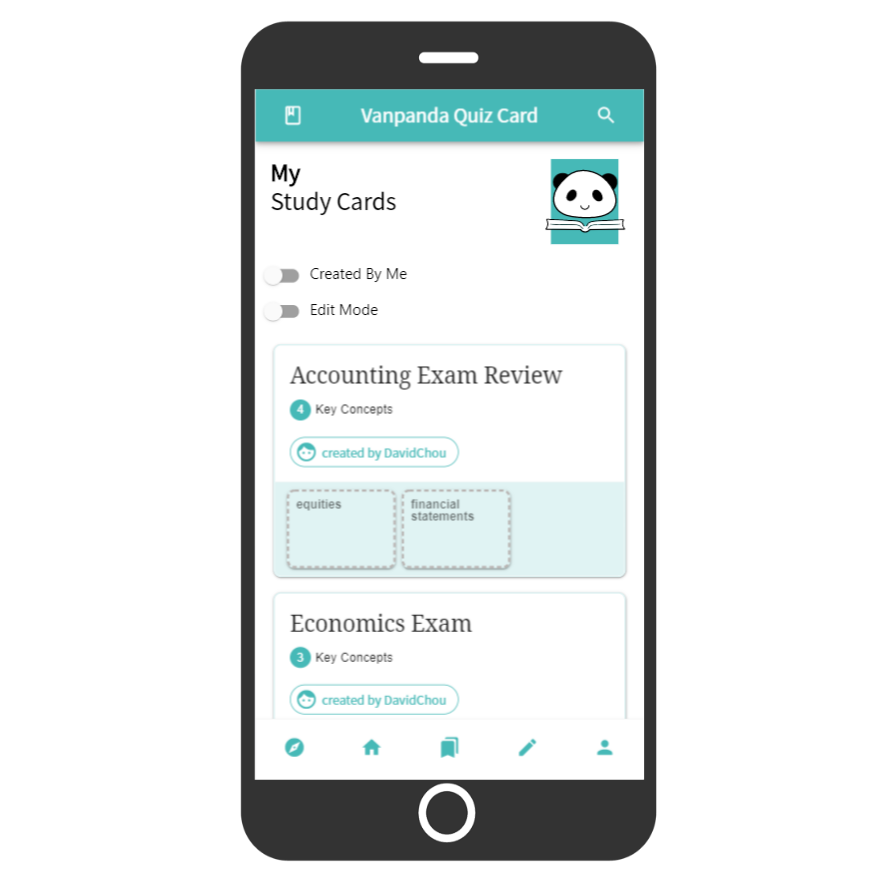
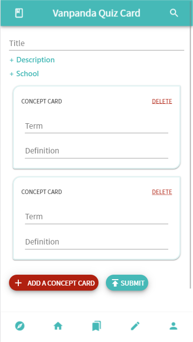
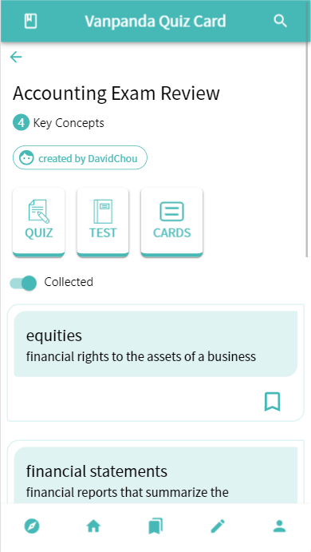
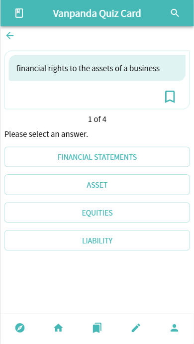
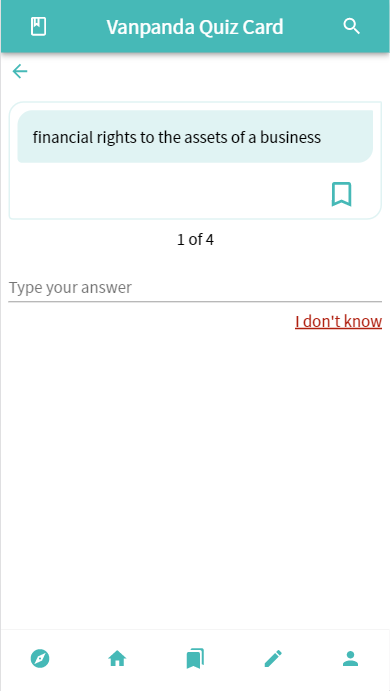
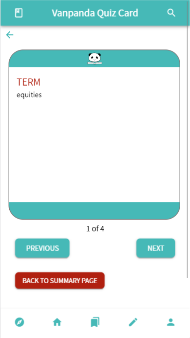

  

Vanpanda quiz card app is a web app that allows users to create their quiz cards and review the quiz cards.

For instructions on setting up the app, please read the document [here](./docs/SetUp.md).

# Core Features

## Create Quiz Cards

Users can create quiz cards.

## Review Quiz Cards

Users can review quiz cards. There are three modes for users to review quiz cards:

### Quiz

Quiz mode is like a multiple choices test. Users can review their total score at the end of the test.

### Test

Test mode is like a fill in blank test. Users can review their total score at the end of the test.

### Cards

Cards mode allows users to review terms and definitions using flash cards. Flip the flash cards to view terms or definitions.

# Additional Features

## Bookmarks

Users can bookmark quiz cards and review them later.

## Search

Users can search quiz cards from our database.

**More features will be added.**
